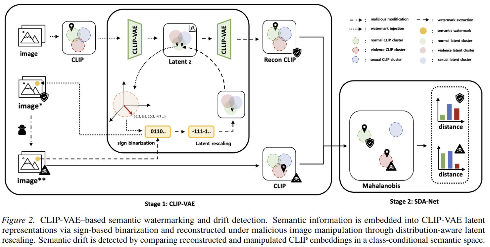

# CLIP-VAE & SDA-Net: Distribution-Based Semantic Watermarking

Code release for the ICML AI4Good 2026 submission *Semantic Watermarking
for Malicious Image Manipulation Detection*. The framework embeds a
recoverable semantic reference into an image as a 100-bit watermark
(**CLIP-VAE**) and exposes the direction of any post-hoc manipulation
through a lightweight prototype module (**SDA-Net**).

This repository extends the original submission with one additional
ablation that **swaps the Gaussian VAE for a hyperspherical (vMF) VAE**
so that the 100-D latent lives directly on the unit sphere `S^99`.

---

## Pipeline



Raw images → CLIP-ViT-B/32 (512-D) → VAE (100-D latent) → sign-based
binarization → 100-bit watermark (channel-aware training with random
bit-flip noise) → SDA-Net prototypes → per-class distance scores +
direction-of-drift signal.

---

## Repository layout

```
colab_codes/
  clip_vae.ipynb              # Main: Gaussian β-VAE on CLIP embeddings
  SDA_net.ipynb               # Prototype-based drift detection on the latent
  baseline_exp.ipynb          # 5-way bit-flip comparison (SimHash, ITQ, HashNet, …)
  ablation_beta_vae.ipynb     # KL weight β sweep
  ablation_vqvae.ipynb        # VQ-VAE vs VAE
  ablation_dimensions.ipynb   # Latent dimensionality sweep
  ablation_inference.ipynb    # Inference-time settings
  ablation_sphere_vae.ipynb   # **Added — hyperspherical (vMF) latent on S^99**
preprocessing/
  prepare_dataset.py          # Build dataset/{train,test}/{normal,sexual,violence}/
  extract_clip_embeddings.py  # CLIP-ViT-B/32 → embeddings/*.npy
embeddings/                   # Pre-computed CLIP features (~16 MB)
figures/                      # Plots from notebook runs + pipeline_overview.png
requirements.txt
```

---

## Quick start

```bash
python -m venv .venv && source .venv/bin/activate
pip install -r requirements.txt
git clone https://github.com/Shilin-LU/VINE.git   # external watermarking backbone
```

**Dataset.** Three public sources (`normal`: Kaggle News images, `violence`:
HOD benchmark, `sexual`: Figshare adult-content set). Image data is
**not** redistributed — see the paper's Reproducibility Statement.
After downloading the three sources into `raw_images/{normal,violence,sexual}/`:

```bash
python preprocessing/prepare_dataset.py --input-dir ./raw_images --output-dir ./dataset --seed 42
python preprocessing/extract_clip_embeddings.py --dataset-dir ./dataset --output-dir ./embeddings
```

| Class | Total | Train | Test |
|---|---:|---:|---:|
| `normal` | 4,000 | 3,200 | 800 |
| `violence` | 2,002 | 1,601 | 401 |
| `sexual` | 2,000 | 1,600 | 400 |

Pre-computed 512-D CLIP embeddings are shipped under `embeddings/` so
the SDA-Net and most ablations can be re-run without redownloading the
images.

---

## Notebook reference

| Notebook | Stage | Needs raw images? | Runtime on T4 |
|---|---|:---:|---:|
| `clip_vae.ipynb` | 1. Train β-VAE | ✅ | ~25 min |
| `SDA_net.ipynb` | 2. Train SDA-Net | — (uses embeddings) | ~15 min |
| `baseline_exp.ipynb` | 3. Bit-flip comparison | partial | ~90 min |
| `ablation_beta_vae.ipynb` | Ablation | — | ~45 min |
| `ablation_vqvae.ipynb` | Ablation | — | ~30 min |
| `ablation_dimensions.ipynb` | Ablation | — | ~50 min |
| `ablation_inference.ipynb` | Ablation | — | ~20 min |
| `ablation_sphere_vae.ipynb` | Ablation (new) | ✅ | ~30 min |

All notebooks ship with cleared outputs; rendered figures from a known-good
run are in `figures/`.

---

## Hyperspherical-latent extension (`ablation_sphere_vae.ipynb`)

**What changes vs `clip_vae.ipynb`.** The Gaussian VAE
(`z = μ + σ ⊙ ε`, prior `N(0, I)`, KL closed-form) is replaced by a
**von Mises–Fisher VAE** (`z ∼ vMF(μ, κ)` on `S^99`, prior uniform on
the hypersphere, KL computed against `Uniform(S^99)`). The encoder
output is normalized to a unit-vector mean direction `μ` and a positive
concentration `κ`; the decoder L2-normalizes the reconstructed CLIP
embedding to keep both ends of the loop on the unit sphere. Loss is
identical in form: `(1 − cos(recon, x)) + β · KL`, with `β = 0.01`.

**Why it should help.** CLIP image embeddings are L2-normalized — they
already live on the unit sphere `S^511`, and CLIP similarity is purely
angular (Wang & Isola, 2020). A Gaussian VAE compresses them into
Euclidean `R^100` and then projects the decoder output back onto the
sphere, which introduces an off-manifold detour the model has to learn
around. The vMF formulation removes that detour: the latent lives
natively on `S^99`, distances in latent space are geodesic distances on
the sphere, and the prior is a meaningful uniform-on-sphere reference
rather than the geometry-blind `N(0, I)`. This was flagged in the
paper itself (Section 5, *Other Untested Alternatives*) as a natural
match for CLIP's L2-normalized manifold but was left untested in the
main submission.

**Measured effect.** On the test split with the same loss, β, and
latent dimensionality as the main `clip_vae.ipynb`:

| Variant | val CLIP cosine | `‖z‖` on test |
|---|---:|---:|
| `clip_vae.ipynb` (Gaussian VAE, baseline) | ~0.80 | not unit-constrained |
| `ablation_sphere_vae.ipynb` (vMF VAE) | **0.846** | **1.000 ± 0.000** |

The hyperspherical variant raises reconstruction cosine by **~4–5
points** on the same training setup, and the latent norm is *exactly*
one at evaluation time (vs only approximately controlled by KL in the
Gaussian case). The trade-off identified in the paper — vMF
reparameterization being "less compatible with sign-based
binarization" — still applies, so this ablation is reported as a
latent-quality result rather than a drop-in replacement inside the
full watermarking pipeline.

---

## Hardware

NVIDIA Tesla T4 (16 GB) — Google Colab free tier. The notebooks unzip
`semantic_wm/dataset.zip` from `/content/drive/MyDrive/semantic_wm/`
into `/content/semantic_wm/` on Colab, and read from `./dataset/`
locally.

---

## License & citation

Code: MIT (see `LICENSE` if present). Datasets are not redistributed.
Citation is suppressed during anonymous review and will be added after
the ICML AI4Good 2026 decision.
